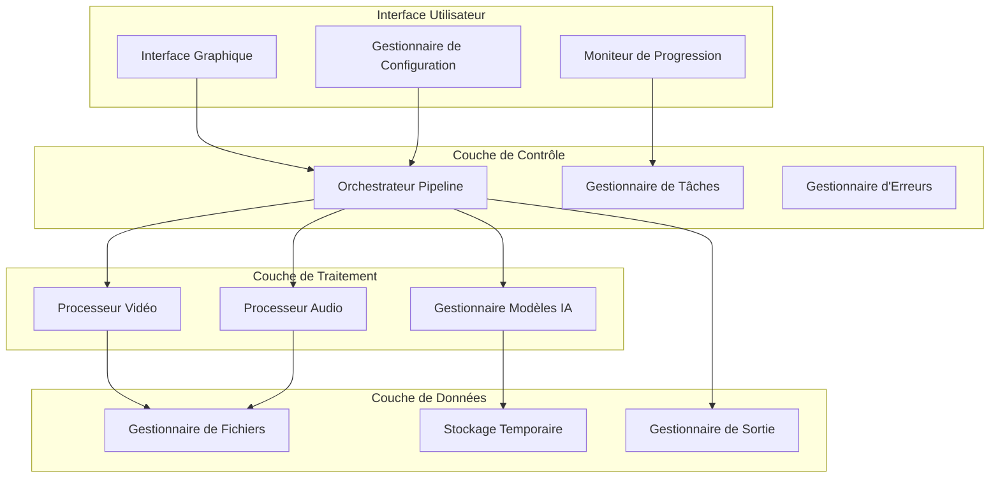

# Document de Conception - Application de Doublage Vidéo par IA

## Vue d'Ensemble

L'application de doublage vidéo par IA est conçue comme un système modulaire en deux parties principales : une interface graphique (GUI) pour l'interaction utilisateur et un pipeline de traitement backend pour l'exécution des tâches d'IA. Le système suit une architecture en couches avec séparation claire des responsabilités, permettant une maintenance facile et une extensibilité future.

## Architecture

### Architecture Générale



### Pipeline de Traitement Séquentiel

Le système exécute 4 phases principales de manière séquentielle :

1. **Phase d'Analyse** : Extraction audio, VAD, diarisation
2. **Phase d'Extraction** : OCR des sous-titres, transcription ASR, alignement
3. **Phase de Préparation** : Segmentation audio, création d'échantillons de référence
4. **Phase de Synthèse** : Clonage de voix, mixage, export final

## Composants et Interfaces

### 1. Interface Graphique (GUI)

**Technologie :** Tkinter ou PyQt6 pour une interface native multiplateforme

**Composants principaux :**
- `MainWindow` : Fenêtre principale avec sélection de fichier et configuration
- `ConfigPanel` : Panneau de configuration des options (séparation de source, modèles)
- `ProgressDialog` : Dialogue de progression avec détails des étapes
- `ResultsWindow` : Fenêtre de résultats avec aperçu et options d'export

**Interface :**
```python
class MainWindow:
    def select_video_file(self) -> str
    def configure_pipeline(self) -> PipelineConfig
    def start_processing(self) -> None
    def show_progress(self, progress: ProgressInfo) -> None
    def show_results(self, results: ProcessingResults) -> None
```

### 2. Orchestrateur Pipeline

**Responsabilité :** Coordination séquentielle de toutes les phases de traitement

**Interface :**
```python
class PipelineOrchestrator:
    def __init__(self, config: PipelineConfig)
    def execute_pipeline(self, video_path: str) -> ProcessingResults
    def register_progress_callback(self, callback: Callable) -> None
    def cancel_processing(self) -> None
```

**Flux d'exécution :**
1. Validation du fichier d'entrée
2. Extraction et analyse audio
3. Traitement vidéo pour OCR
4. Synchronisation et alignement
5. Préparation du clonage
6. Synthèse et export

### 3. Processeur Vidéo

**Technologie :** FFmpeg via python-ffmpeg

**Responsabilités :**
- Extraction de pistes audio en WAV/FLAC
- Extraction d'images pour OCR
- Fusion finale audio/vidéo

**Interface :**
```python
class VideoProcessor:
    def extract_audio(self, video_path: str) -> str
    def extract_frames_during_speech(self, video_path: str, speech_intervals: List[Interval]) -> List[Frame]
    def merge_audio_video(self, video_path: str, audio_path: str, output_path: str) -> None
```

### 4. Processeur Audio

**Technologies :** 
- Pyannote.audio pour VAD et diarisation
- Demucs pour séparation de source (optionnel)
- Librosa pour normalisation

**Interface :**
```python
class AudioProcessor:
    def detect_voice_activity(self, audio_path: str) -> List[Interval]
    def perform_speaker_diarization(self, audio_path: str) -> SpeakerSegments
    def separate_sources(self, audio_path: str) -> SourceSeparationResult
    def segment_by_speaker(self, audio_path: str, diarization: SpeakerSegments) -> Dict[str, str]
    def normalize_audio(self, audio_path: str) -> str
```

### 5. Gestionnaire Modèles IA

**Responsabilités :** Chargement, gestion mémoire et exécution des modèles IA

**Modèles supportés :**
- **ASR :** Whisper (GGUF), WhisperX, ou modèles NeMo
- **OCR :** Qwen-VL (GGUF) ou PaddleOCR
- **Diarisation :** Pyannote.audio
- **Clonage de voix :** Tortoise-TTS ou modèles NeMo

**Interface :**
```python
class AIModelManager:
    def load_model(self, model_type: ModelType, model_name: str) -> None
    def transcribe_audio(self, audio_path: str) -> TranscriptionResult
    def extract_text_from_frames(self, frames: List[Frame]) -> List[OCRResult]
    def clone_voice(self, reference_audio: str, text: str) -> str
    def unload_model(self, model_type: ModelType) -> None
```

### 6. Gestionnaire de Synchronisation

**Responsabilité :** Alignement intelligent entre OCR et ASR

**Interface :**
```python
class SynchronizationManager:
    def align_ocr_with_asr(self, ocr_results: List[OCRResult], asr_result: TranscriptionResult) -> AlignmentResult
    def split_subtitles_by_speaker(self, subtitles: List[Subtitle], diarization: SpeakerSegments) -> Dict[str, List[Subtitle]]
    def create_final_dialogue_mapping(self) -> Dict[str, List[DialogueSegment]]
```

## Modèles de Données

### Configuration du Pipeline
```python
@dataclass
class PipelineConfig:
    enable_source_separation: bool = False
    asr_model: str = "whisper-large-v3"
    ocr_model: str = "qwen-vl"
    voice_cloning_model: str = "tortoise-tts"
    output_codec: str = "h264"
    output_bitrate: str = "5M"
    temp_directory: str = "./temp"
```

### Résultats de Traitement
```python
@dataclass
class ProcessingResults:
    output_video_path: str
    processing_time: float
    speakers_detected: int
    dialogue_segments: int
    quality_metrics: Dict[str, float]
    intermediate_files: List[str]
```

### Segments de Dialogue
```python
@dataclass
class DialogueSegment:
    speaker_id: str
    start_time: float
    end_time: float
    original_text: str
    audio_path: str
    confidence_score: float
```

## Gestion des Erreurs

### Stratégie de Gestion d'Erreurs

1. **Erreurs de Validation :** Vérification des formats de fichiers et de la disponibilité des modèles
2. **Erreurs de Traitement :** Gestion des échecs de modèles IA avec fallbacks
3. **Erreurs de Ressources :** Monitoring mémoire avec options de réduction de qualité
4. **Erreurs de Synchronisation :** Mécanismes de récupération pour l'alignement

**Interface :**
```python
class ErrorHandler:
    def handle_validation_error(self, error: ValidationError) -> None
    def handle_processing_error(self, error: ProcessingError) -> bool  # True si récupération possible
    def handle_resource_error(self, error: ResourceError) -> None
    def suggest_fallback_options(self, error: Any) -> List[str]
```

## Stratégie de Test

### Tests Unitaires
- Tests de chaque composant isolément
- Mocks pour les modèles IA coûteux
- Validation des formats de données

### Tests d'Intégration
- Pipeline complet avec fichiers de test courts
- Validation de la synchronisation audio/vidéo
- Tests de performance avec différentes tailles de fichiers

### Tests de Qualité
- Métriques de qualité audio (SNR, distorsion)
- Validation de la synchronisation labiale
- Tests de régression sur des échantillons de référence

**Structure de test :**
```python
class TestPipeline:
    def test_video_processing_pipeline(self)
    def test_audio_extraction_and_analysis(self)
    def test_ocr_and_asr_alignment(self)
    def test_voice_cloning_quality(self)
    def test_error_handling_scenarios(self)
```

## Optimisations de Performance

### Gestion Mémoire
- Chargement paresseux des modèles IA
- Libération automatique de mémoire entre phases
- Traitement par chunks pour les gros fichiers

### Parallélisation
- OCR et ASR en parallèle quand possible
- Traitement multi-thread pour la segmentation audio
- Cache des résultats intermédiaires

### Optimisations Spécifiques
- Utilisation de formats audio optimisés (FLAC pour qualité, WAV pour vitesse)
- Réduction de résolution vidéo pour OCR si nécessaire
- Compression temporaire des fichiers intermédiaires