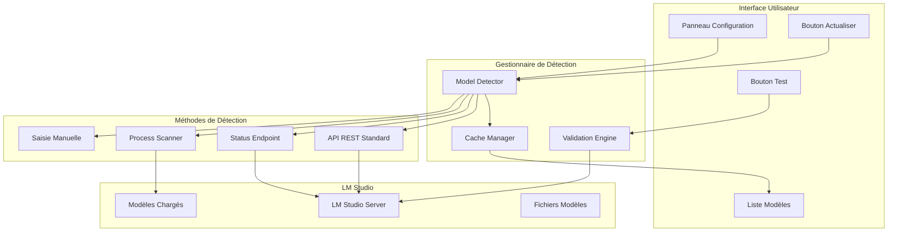

# Document de Conception - Amélioration Détection Modèles LM Studio

## Vue d'Ensemble

Cette conception améliore la détection des modèles LM Studio en implémentant plusieurs méthodes de découverte pour assurer une détection robuste des modèles chargés localement. Le système actuel ne détecte que les modèles via l'API REST standard, mais de nombreux modèles multimodaux chargés dans LM Studio ne sont pas listés par cette API.

La solution propose une approche multi-méthodes avec cache intelligent, interface utilisateur améliorée, et gestion robuste des erreurs.

## Architecture

### Architecture de Détection Multi-Méthodes



## Composants et Interfaces

### 1. Enhanced LM Studio Manager

**Responsabilité :** Gestionnaire amélioré avec détection multi-méthodes

**Interface :**
```python
class EnhancedLMStudioManager:
    def __init__(self, base_url: str = "http://localhost:1234"):
        self.base_url = base_url
        self.model_detector = ModelDetector()
        self.cache_manager = CacheManager()
        self.validation_engine = ValidationEngine()
        
    def get_available_models_enhanced(self, force_refresh: bool = False) -> List[Dict[str, Any]]:
        """Détection améliorée avec cache et multi-méthodes"""
        
    def detect_loaded_models(self) -> List[Dict[str, Any]]:
        """Détecte spécifiquement les modèles chargés en mémoire"""
        
    def scan_multimodal_models(self) -> List[Dict[str, Any]]:
        """Scan spécialisé pour les modèles multimodaux/OCR"""
        
    def validate_model_capabilities(self, model_name: str) -> ModelCapabilities:
        """Valide et teste les capacités d'un modèle"""
        
    def get_model_recommendations(self) -> Dict[str, str]:
        """Recommande les meilleurs modèles pour chaque tâche"""
```

### 2. Model Detector

**Responsabilité :** Orchestration des différentes méthodes de détection

**Interface :**
```python
class ModelDetector:
    def __init__(self, lm_studio_url: str):
        self.lm_studio_url = lm_studio_url
        self.detection_methods = [
            APIDetectionMethod(),
            StatusDetectionMethod(),
            ProcessDetectionMethod(),
            ManualDetectionMethod()
        ]
        
    def detect_all_models(self) -> List[DetectedModel]:
        """Utilise toutes les méthodes de détection disponibles"""
        
    def merge_detection_results(self, results: List[List[DetectedModel]]) -> List[DetectedModel]:
        """Fusionne les résultats sans doublons"""
        
    def prioritize_models(self, models: List[DetectedModel]) -> List[DetectedModel]:
        """Priorise les modèles selon leur qualité et disponibilité"""
```

### 3. Detection Methods

**Méthodes de détection spécialisées :**

```python
class APIDetectionMethod:
    """Détection via API REST standard"""
    def detect(self, lm_studio_url: str) -> List[DetectedModel]:
        """Utilise l'endpoint /v1/models standard"""

class StatusDetectionMethod:
    """Détection via endpoints de statut"""
    def detect(self, lm_studio_url: str) -> List[DetectedModel]:
        """Utilise des endpoints alternatifs comme /v1/internal/status"""

class ProcessDetectionMethod:
    """Détection via analyse des processus"""
    def detect(self, lm_studio_url: str) -> List[DetectedModel]:
        """Analyse les processus LM Studio pour détecter les modèles chargés"""

class ManualDetectionMethod:
    """Méthode de saisie manuelle"""
    def detect(self, lm_studio_url: str) -> List[DetectedModel]:
        """Permet la saisie manuelle de modèles"""
```

### 4. Cache Manager

**Responsabilité :** Gestion intelligente du cache des modèles détectés

**Interface :**
```python
class CacheManager:
    def __init__(self, cache_duration: int = 300):  # 5 minutes
        self.cache_duration = cache_duration
        self.model_cache: Dict[str, CachedModelList] = {}
        
    def get_cached_models(self, cache_key: str) -> Optional[List[DetectedModel]]:
        """Récupère les modèles du cache si valides"""
        
    def cache_models(self, cache_key: str, models: List[DetectedModel]) -> None:
        """Met en cache la liste des modèles"""
        
    def invalidate_cache(self, cache_key: str = None) -> None:
        """Invalide le cache spécifique ou tout le cache"""
        
    def is_cache_valid(self, cache_key: str) -> bool:
        """Vérifie si le cache est encore valide"""
```

### 5. Validation Engine

**Responsabilité :** Test et validation des capacités des modèles

**Interface :**
```python
class ValidationEngine:
    def __init__(self, lm_studio_manager):
        self.lm_studio_manager = lm_studio_manager
        self.test_images = self._load_test_images()
        
    def test_model_ocr_capability(self, model_name: str) -> OCRTestResult:
        """Teste les capacités OCR d'un modèle avec une image de test"""
        
    def test_model_multimodal_capability(self, model_name: str) -> MultimodalTestResult:
        """Teste les capacités multimodales générales"""
        
    def benchmark_model_performance(self, model_name: str) -> PerformanceBenchmark:
        """Benchmark de performance pour un modèle"""
        
    def recommend_best_ocr_model(self, available_models: List[DetectedModel]) -> Optional[DetectedModel]:
        """Recommande le meilleur modèle OCR parmi ceux disponibles"""
```

## Modèles de Données

### Modèle Détecté
```python
@dataclass
class DetectedModel:
    name: str
    display_name: str
    model_type: ModelType  # ASR, OCR, MULTIMODAL, LANGUAGE
    capabilities: List[str]  # ['image_analysis', 'ocr', 'transcription']
    source: DetectionSource  # API, STATUS, PROCESS, MANUAL
    status: ModelStatus  # LOADED, AVAILABLE, UNKNOWN
    confidence: float  # Confiance dans la détection (0.0-1.0)
    metadata: Dict[str, Any]
    
    # Informations spécifiques OCR
    ocr_quality: str  # 'high', 'medium', 'basic'
    supported_languages: List[str]
    max_image_size: Optional[int]
    
    # Informations de performance
    estimated_speed: str  # 'fast', 'medium', 'slow'
    memory_usage: str  # 'low', 'medium', 'high'
    
@dataclass
class ModelCapabilities:
    supports_ocr: bool
    supports_transcription: bool
    supports_multimodal: bool
    supported_image_formats: List[str]
    max_context_length: Optional[int]
    
@dataclass
class OCRTestResult:
    model_name: str
    test_successful: bool
    extracted_text: Optional[str]
    confidence_score: float
    processing_time: float
    error_message: Optional[str]
    quality_rating: str  # 'excellent', 'good', 'fair', 'poor'
```

### Configuration Étendue
```python
@dataclass
class LMStudioConfig:
    base_url: str = "http://localhost:1234"
    enable_api_detection: bool = True
    enable_status_detection: bool = True
    enable_process_detection: bool = True
    enable_manual_entry: bool = True
    
    # Cache
    cache_duration: int = 300  # 5 minutes
    auto_refresh_interval: int = 60  # 1 minute
    
    # Validation
    enable_model_testing: bool = True
    test_timeout: int = 30
    
    # Modèles préférés
    preferred_ocr_model: Optional[str] = None
    preferred_transcription_model: Optional[str] = None
    manual_models: List[str] = field(default_factory=list)
    
    # Fallbacks
    fallback_to_local_models: bool = True
    retry_attempts: int = 3
    retry_delay: float = 2.0
```

## Amélioration de l'Interface Utilisateur

### Enhanced Config Panel

```python
class EnhancedConfigPanelQt(ConfigPanelQt):
    def create_enhanced_models_tab(self):
        """Onglet modèles amélioré avec détection LM Studio"""
        tab = QWidget()
        layout = QVBoxLayout(tab)
        
        # Section LM Studio
        lm_studio_group = QGroupBox("🤖 LM Studio - Modèles Détectés")
        lm_studio_layout = QVBoxLayout(lm_studio_group)
        
        # Contrôles de détection
        detection_controls = QHBoxLayout()
        
        self.refresh_lm_btn = QPushButton("🔄 Actualiser")
        self.refresh_lm_btn.clicked.connect(self.refresh_lm_studio_models_enhanced)
        detection_controls.addWidget(self.refresh_lm_btn)
        
        self.test_models_btn = QPushButton("🧪 Tester Modèles")
        self.test_models_btn.clicked.connect(self.test_lm_studio_models)
        detection_controls.addWidget(self.test_models_btn)
        
        self.manual_add_btn = QPushButton("➕ Ajouter Manuellement")
        self.manual_add_btn.clicked.connect(self.add_manual_model)
        detection_controls.addWidget(self.manual_add_btn)
        
        detection_controls.addStretch()
        lm_studio_layout.addLayout(detection_controls)
        
        # Liste des modèles détectés
        self.detected_models_list = QListWidget()
        self.detected_models_list.itemDoubleClicked.connect(self.test_selected_model)
        lm_studio_layout.addWidget(self.detected_models_list)
        
        # Informations sur le modèle sélectionné
        model_info_group = QGroupBox("Informations Modèle")
        model_info_layout = QVBoxLayout(model_info_group)
        
        self.model_info_text = QTextEdit()
        self.model_info_text.setMaximumHeight(100)
        self.model_info_text.setReadOnly(True)
        model_info_layout.addWidget(self.model_info_text)
        
        lm_studio_layout.addWidget(model_info_group)
        
        # Sélection pour OCR
        ocr_selection_layout = QHBoxLayout()
        ocr_selection_layout.addWidget(QLabel("Modèle OCR sélectionné:"))
        
        self.lm_ocr_combo = QComboBox()
        self.lm_ocr_combo.currentTextChanged.connect(self.on_ocr_model_changed)
        ocr_selection_layout.addWidget(self.lm_ocr_combo)
        
        lm_studio_layout.addLayout(ocr_selection_layout)
        
        layout.addWidget(lm_studio_group)
        return tab
    
    def refresh_lm_studio_models_enhanced(self):
        """Actualisation améliorée des modèles LM Studio"""
        try:
            # Afficher une barre de progression
            progress = QProgressBar()
            progress.setRange(0, 0)  # Mode indéterminé
            
            # Créer le gestionnaire amélioré
            enhanced_manager = EnhancedLMStudioManager()
            
            # Détecter tous les modèles
            detected_models = enhanced_manager.get_available_models_enhanced(force_refresh=True)
            
            # Mettre à jour la liste
            self.update_detected_models_list(detected_models)
            
            # Mettre à jour les combos
            self.update_model_combos(detected_models)
            
            # Afficher le résultat
            QMessageBox.information(
                self,
                "Détection LM Studio",
                f"✅ {len(detected_models)} modèles détectés\n"
                f"📊 Méthodes utilisées: API, Status, Process\n"
                f"🎯 Modèles OCR: {len([m for m in detected_models if 'ocr' in m.capabilities])}"
            )
            
        except Exception as e:
            QMessageBox.warning(
                self,
                "Erreur Détection",
                f"❌ Erreur lors de la détection:\n{str(e)}"
            )
    
    def test_lm_studio_models(self):
        """Teste tous les modèles LM Studio détectés"""
        try:
            enhanced_manager = EnhancedLMStudioManager()
            validation_engine = enhanced_manager.validation_engine
            
            # Obtenir les modèles à tester
            models_to_test = [item.data(Qt.UserRole) for item in self.get_selected_models()]
            
            if not models_to_test:
                QMessageBox.information(
                    self,
                    "Test Modèles",
                    "Veuillez sélectionner au moins un modèle à tester."
                )
                return
            
            # Tester chaque modèle
            test_results = []
            for model in models_to_test:
                if 'ocr' in model.capabilities:
                    result = validation_engine.test_model_ocr_capability(model.name)
                    test_results.append(result)
            
            # Afficher les résultats
            self.show_test_results(test_results)
            
        except Exception as e:
            QMessageBox.warning(
                self,
                "Erreur Test",
                f"❌ Erreur lors du test:\n{str(e)}"
            )
```

## Stratégie d'Implémentation

### Phase 1: Détection Multi-Méthodes
1. Implémenter les différentes méthodes de détection
2. Créer le système de fusion des résultats
3. Ajouter la gestion du cache

### Phase 2: Interface Utilisateur
1. Améliorer le panneau de configuration
2. Ajouter les contrôles de test et validation
3. Implémenter la saisie manuelle

### Phase 3: Validation et Tests
1. Créer le moteur de validation
2. Implémenter les tests OCR automatiques
3. Ajouter les recommandations de modèles

### Phase 4: Intégration
1. Intégrer avec le système existant
2. Ajouter la persistance de configuration
3. Implémenter les fallbacks robustes

## Gestion des Erreurs

### Stratégies de Récupération
- **API indisponible** : Basculement vers méthodes alternatives
- **Modèles non détectés** : Proposition de saisie manuelle
- **Tests échoués** : Suggestions de configuration
- **Cache corrompu** : Régénération automatique

Cette conception assure une détection robuste et complète des modèles LM Studio, particulièrement pour les modèles multimodaux utilisés en OCR.