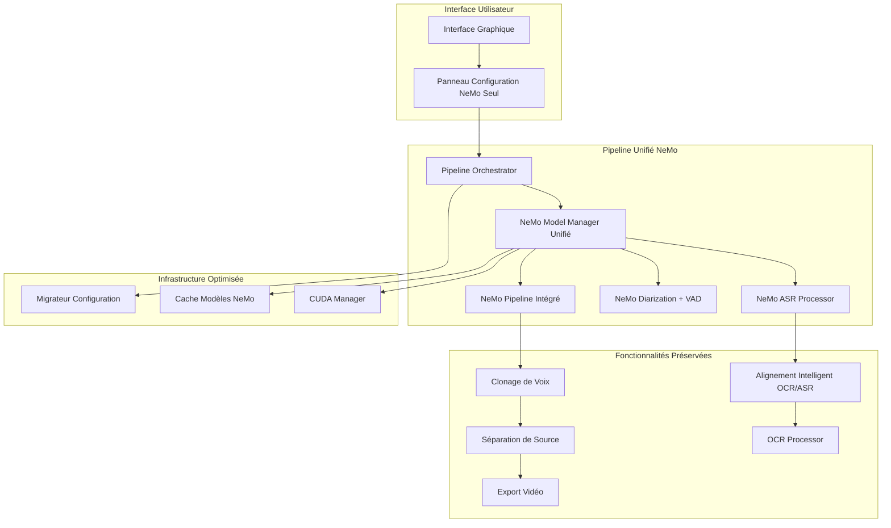
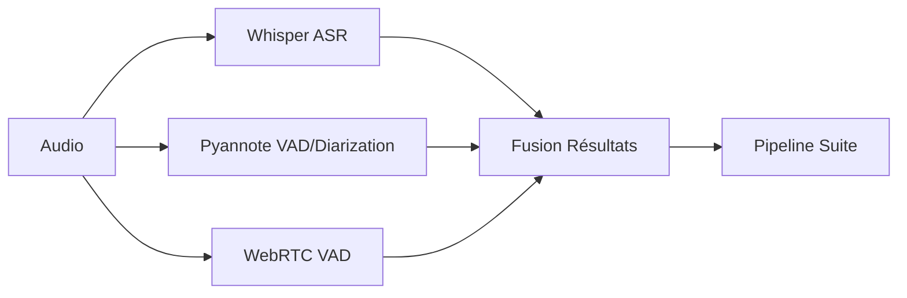
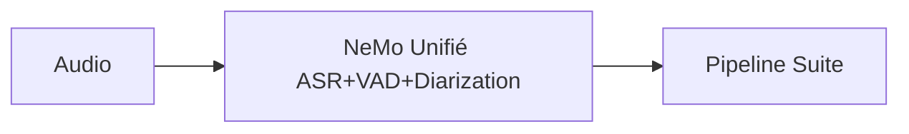

# Document de Conception - Migration Complète vers NVIDIA NeMo

## Vue d'Ensemble

Cette conception détaille la migration complète de l'application de doublage vidéo vers NVIDIA NeMo comme unique système pour la transcription, détection d'activité vocale (VAD) et diarisation des locuteurs. L'objectif est d'éliminer toute redondance en supprimant Whisper, Pyannote.audio et leurs dépendances, tout en préservant intégralement l'OCR, l'alignement intelligent, le clonage de voix, la séparation de source et l'export vidéo.

Cette migration s'appuie sur l'architecture NeMo existante (spécification nvidia-nemo-integration) pour l'étendre et remplacer complètement les anciens systèmes.

## Architecture

### Architecture Cible Post-Migration



### Comparaison Avant/Après Migration

**AVANT (Architecture Actuelle):**


**APRÈS (Architecture Cible):**


## Composants et Interfaces

### 1. NeMo Model Manager Unifié

**Responsabilité :** Gestionnaire unique pour tous les modèles NeMo, remplaçant tous les anciens gestionnaires

**Interface Refactorisée :**
```python
class UnifiedNeMoModelManager:
    """Gestionnaire unifié remplaçant AIModelManager pour les fonctions audio"""
    
    def __init__(self, cuda_manager: CUDAManager):
        self.cuda_manager = cuda_manager
        self.loaded_models: Dict[str, Any] = {}
        self.model_cache = NeMoModelCache()
        
        # Plus de références aux anciens systèmes
        self.whisper_manager = None  # SUPPRIMÉ
        self.pyannote_manager = None  # SUPPRIMÉ
        
    def get_available_models(self) -> List[str]:
        """Retourne uniquement les modèles NeMo disponibles"""
        return [
            "nemo-conformer-ctc-large-fr",
            "nemo-fastconformer-multilingual", 
            "nemo-titanet-large-diarization",
            "nemo-conformer-transducer-large"
        ]
        
    def transcribe_audio(self, audio_path: str, config: NeMoConfig) -> NeMoTranscriptionResult:
        """Transcription uniquement avec NeMo - plus de fallback Whisper"""
        
    def diarize_audio(self, audio_path: str, config: NeMoConfig) -> NeMoDiarizationResult:
        """Diarisation uniquement avec NeMo - plus de fallback Pyannote"""
        
    def detect_voice_activity(self, audio_path: str) -> VADResult:
        """VAD intégrée NeMo - plus de WebRTC ou Pyannote VAD"""
        
    def process_audio_complete(self, audio_path: str, config: NeMoConfig) -> CompleteAudioResult:
        """Pipeline complet ASR+VAD+Diarization en une seule passe"""
```

### 2. Configuration Migrator

**Responsabilité :** Migration automatique des anciennes configurations vers NeMo

**Interface :**
```python
class ConfigurationMigrator:
    """Migre les configurations legacy vers NeMo"""
    
    def __init__(self):
        self.migration_mappings = {
            # Mapping Whisper -> NeMo
            "whisper-tiny": "nemo-conformer-ctc-small",
            "whisper-base": "nemo-conformer-ctc-medium", 
            "whisper-large-v3": "nemo-conformer-ctc-large-fr",
            
            # Mapping Pyannote -> NeMo
            "pyannote/speaker-diarization": "nemo-titanet-large-diarization",
            "pyannote/segmentation": "nemo-vad-marblenet",
        }
        
    def migrate_config_file(self, config_path: str) -> MigrationResult:
        """Migre un fichier de configuration complet"""
        
    def convert_whisper_params(self, whisper_config: Dict) -> NeMoConfig:
        """Convertit les paramètres Whisper vers NeMo"""
        
    def convert_pyannote_params(self, pyannote_config: Dict) -> NeMoConfig:
        """Convertit les paramètres Pyannote vers NeMo"""
        
    def backup_old_config(self, config_path: str) -> str:
        """Sauvegarde l'ancienne configuration avant migration"""
        
    def validate_migrated_config(self, nemo_config: NeMoConfig) -> ValidationResult:
        """Valide la configuration migrée"""
```

### 3. Legacy Code Remover

**Responsabilité :** Suppression automatique du code legacy et des dépendances

**Interface :**
```python
class LegacyCodeRemover:
    """Supprime le code et dépendances legacy"""
    
    def __init__(self):
        self.modules_to_remove = [
            "whisper", "openai-whisper", "whisperx",
            "pyannote.audio", "pyannote.core", "pyannote.database",
            "webrtcvad", "speechbrain"  # Si utilisé uniquement pour VAD
        ]
        
        self.files_to_remove = [
            "whisper_processor.py",
            "pyannote_processor.py", 
            "webrtc_vad.py",
            "legacy_audio_processor.py"
        ]
        
    def analyze_dependencies(self) -> DependencyAnalysis:
        """Analyse les dépendances à supprimer"""
        
    def remove_unused_imports(self, file_path: str) -> RemovalResult:
        """Supprime les imports inutilisés dans un fichier"""
        
    def refactor_class_inheritance(self, class_path: str) -> RefactorResult:
        """Refactorise l'héritage des classes pour supprimer les dépendances legacy"""
        
    def update_requirements_files(self) -> UpdateResult:
        """Met à jour les fichiers requirements pour supprimer les dépendances"""
        
    def clean_model_cache(self) -> CleanupResult:
        """Nettoie le cache des anciens modèles"""
```

### 4. Preserved Components Adapter

**Responsabilité :** Adaptation des composants préservés pour utiliser NeMo

**Interface :**
```python
class PreservedComponentsAdapter:
    """Adapte les composants préservés pour utiliser les résultats NeMo"""
    
    def __init__(self, nemo_manager: UnifiedNeMoModelManager):
        self.nemo_manager = nemo_manager
        
    def adapt_ocr_alignment(self, ocr_processor: OCRProcessor) -> AdaptedOCRProcessor:
        """Adapte l'alignement OCR pour utiliser les résultats ASR NeMo"""
        
    def adapt_voice_cloner(self, voice_cloner: VoiceCloner) -> AdaptedVoiceCloner:
        """Adapte le clonage de voix pour les segments diarisés par NeMo"""
        
    def adapt_source_separation(self, separator: SourceSeparation) -> AdaptedSourceSeparation:
        """Adapte la séparation de source pour utiliser la VAD NeMo"""
        
    def adapt_video_exporter(self, exporter: VideoExporter) -> AdaptedVideoExporter:
        """Adapte l'export vidéo pour les nouveaux formats de résultats"""
```

## Modèles de Données

### Configuration NeMo Unifiée
```python
@dataclass
class UnifiedNeMoConfig:
    """Configuration unifiée pour toutes les fonctions NeMo"""
    
    # Modèles (plus de choix Whisper/Pyannote)
    asr_model: str = "nemo-conformer-ctc-large-fr"
    diarization_model: str = "nemo-titanet-large-diarization"
    vad_model: str = "nemo-vad-marblenet"
    language: str = "fr"
    
    # Mode de traitement unifié
    processing_mode: str = "unified"  # "asr_only", "diarization_only", "unified"
    
    # Dispositif de calcul
    device_mode: str = "auto"  # "auto", "gpu", "cpu"
    
    # Paramètres unifiés
    enable_word_timestamps: bool = True
    enable_speaker_timestamps: bool = True
    enable_vad: bool = True
    confidence_threshold: float = 0.7
    
    # Optimisations
    batch_size: int = 16
    use_mixed_precision: bool = True
    enable_caching: bool = True
    
    # Plus de paramètres legacy
    # whisper_model: str = None  # SUPPRIMÉ
    # pyannote_model: str = None  # SUPPRIMÉ
    # enable_whisper_fallback: bool = False  # SUPPRIMÉ
```

### Résultats Unifiés
```python
@dataclass
class UnifiedAudioResult:
    """Résultat unifié combinant ASR, VAD et Diarisation"""
    
    # Transcription
    text: str
    word_timestamps: List[WordTimestamp]
    confidence_scores: List[float]
    
    # Diarisation
    speaker_segments: List[SpeakerSegment]
    num_speakers: int
    speaker_embeddings: Dict[str, np.ndarray]
    
    # VAD
    voice_activity: List[VADSegment]
    silence_segments: List[TimeInterval]
    
    # Métadonnées
    processing_time: float
    model_versions: Dict[str, str]
    quality_metrics: UnifiedQualityMetrics
    
    # Plus de champs legacy
    # whisper_result: WhisperResult = None  # SUPPRIMÉ
    # pyannote_result: PyannoteResult = None  # SUPPRIMÉ
```

### Migration Result
```python
@dataclass
class MigrationResult:
    """Résultat de la migration de configuration"""
    
    success: bool
    migrated_config: UnifiedNeMoConfig
    backup_path: str
    warnings: List[str]
    errors: List[str]
    
    # Détails de migration
    whisper_params_migrated: Dict[str, str]
    pyannote_params_migrated: Dict[str, str]
    unsupported_params: List[str]
    performance_impact: PerformanceImpact
```

## Stratégie de Migration

### Phase 1: Préparation et Analyse
1. **Analyse de dépendances** : Identifier tous les usages de Whisper/Pyannote
2. **Sauvegarde** : Créer des sauvegardes complètes des configurations
3. **Validation NeMo** : Vérifier que NeMo peut remplacer toutes les fonctionnalités

### Phase 2: Migration du Code
1. **Refactorisation des classes** : Remplacer les héritages legacy
2. **Suppression des imports** : Nettoyer tous les imports inutilisés
3. **Adaptation des interfaces** : Modifier les APIs pour NeMo uniquement

### Phase 3: Migration des Configurations
1. **Conversion automatique** : Migrer les configs utilisateur
2. **Validation** : Tester les nouvelles configurations
3. **Fallback** : Gérer les cas de migration impossible

### Phase 4: Nettoyage et Optimisation
1. **Suppression des dépendances** : Nettoyer requirements.txt
2. **Optimisation** : Ajuster les performances pour NeMo seul
3. **Tests de régression** : Valider que tout fonctionne

## Gestion des Erreurs et Fallbacks

### Stratégies de Fallback Post-Migration

**Plus de fallback vers Whisper/Pyannote** - Nouvelles stratégies :

```python
class NeMoOnlyFallbackManager:
    """Gestionnaire de fallback pour NeMo uniquement"""
    
    def handle_asr_failure(self, error: ASRError) -> FallbackStrategy:
        """Fallback ASR : modèle NeMo plus léger ou CPU"""
        strategies = [
            "switch_to_lighter_nemo_model",
            "switch_to_cpu_processing", 
            "reduce_batch_size",
            "segment_audio_smaller"
        ]
        
    def handle_diarization_failure(self, error: DiarizationError) -> FallbackStrategy:
        """Fallback Diarization : paramètres moins stricts"""
        strategies = [
            "reduce_clustering_threshold",
            "increase_min_segment_duration",
            "disable_overlap_detection",
            "fallback_to_simple_vad_segmentation"
        ]
        
    def handle_memory_error(self, error: MemoryError) -> FallbackStrategy:
        """Fallback mémoire : optimisations agressives"""
        strategies = [
            "clear_model_cache",
            "switch_to_cpu",
            "reduce_precision_to_fp16",
            "process_in_smaller_chunks"
        ]
```

## Optimisations Post-Migration

### Optimisations Spécifiques NeMo Seul

1. **Cache Unifié** : Un seul cache pour tous les modèles NeMo
2. **Pipeline Optimisé** : Traitement en une passe ASR+VAD+Diarization
3. **Mémoire Partagée** : Partage des embeddings entre tâches
4. **Batch Processing** : Traitement par lots optimisé

```python
class NeMoOptimizer:
    """Optimisations spécifiques à NeMo seul"""
    
    def optimize_unified_pipeline(self) -> OptimizationResult:
        """Optimise le pipeline unifié NeMo"""
        
    def optimize_memory_sharing(self) -> MemoryOptimization:
        """Optimise le partage mémoire entre modèles NeMo"""
        
    def optimize_batch_processing(self) -> BatchOptimization:
        """Optimise le traitement par lots"""
        
    def benchmark_performance_gain(self) -> PerformanceBenchmark:
        """Mesure les gains de performance post-migration"""
```

## Préservation des Fonctionnalités

### Composants Intacts

Les composants suivants restent **complètement inchangés** :

1. **OCR Processor** : Aucune modification
2. **Voice Cloner** : Aucune modification  
3. **Source Separation** : Aucune modification
4. **Video Exporter** : Aucune modification

### Composants Adaptés

**Alignement Intelligent** : Seule modification = utiliser les résultats ASR de NeMo au lieu de Whisper

```python
class IntelligentAlignment:
    """Alignement OCR/ASR - adapté pour NeMo"""
    
    def __init__(self, nemo_manager: UnifiedNeMoModelManager):
        self.nemo_manager = nemo_manager  # Remplace whisper_manager
        
    def align_ocr_with_asr(self, ocr_result: OCRResult, audio_path: str) -> AlignmentResult:
        """Alignement utilisant les résultats ASR NeMo"""
        # Utilise nemo_manager.transcribe_audio() au lieu de whisper
        asr_result = self.nemo_manager.transcribe_audio(audio_path)
        return self._perform_alignment(ocr_result, asr_result)
        
    def _perform_alignment(self, ocr_result: OCRResult, asr_result: NeMoTranscriptionResult) -> AlignmentResult:
        """Logique d'alignement inchangée - seul le type d'entrée change"""
        # Même algorithme, format d'entrée adapté
```

## Tests de Régression

### Suite de Tests Post-Migration

```python
class MigrationRegressionTests:
    """Tests de régression pour valider la migration"""
    
    def test_transcription_quality_maintained(self):
        """Vérifie que la qualité de transcription est maintenue ou améliorée"""
        
    def test_diarization_accuracy_maintained(self):
        """Vérifie que la précision de diarisation est maintenue ou améliorée"""
        
    def test_ocr_alignment_unchanged(self):
        """Vérifie que l'alignement OCR fonctionne identiquement"""
        
    def test_voice_cloning_unchanged(self):
        """Vérifie que le clonage de voix n'est pas affecté"""
        
    def test_source_separation_unchanged(self):
        """Vérifie que la séparation de source n'est pas affectée"""
        
    def test_video_export_unchanged(self):
        """Vérifie que l'export vidéo produit les mêmes résultats"""
        
    def test_performance_improved(self):
        """Vérifie que les performances sont améliorées"""
        
    def test_memory_usage_optimized(self):
        """Vérifie que l'utilisation mémoire est optimisée"""
```

Cette conception assure une migration complète et propre vers NeMo tout en préservant toutes les fonctionnalités critiques de l'application.