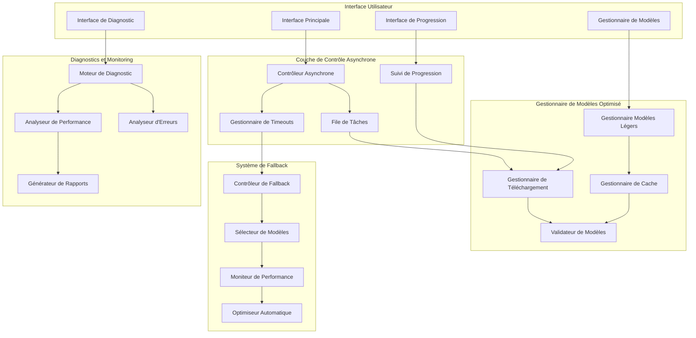
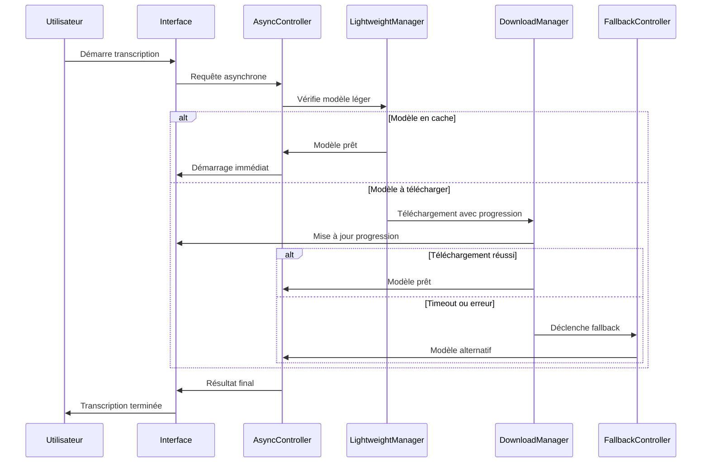

# Document de Conception - Optimisation Performance et Résolution des Blocages NeMo

## Vue d'Ensemble

Cette conception vise à transformer l'expérience utilisateur avec NeMo en éliminant les blocages, en optimisant les performances et en fournissant un feedback approprié. L'approche se base sur des opérations asynchrones, des modèles légers par défaut, un système de cache intelligent et des fallbacks automatiques.

## Architecture

### Architecture de Performance NeMo



### Flux de Traitement Optimisé



## Composants et Interfaces

### 1. Contrôleur Asynchrone

**Responsabilité :** Gestion des opérations longues sans blocage de l'interface

```python
class AsyncNeMoController:
    def __init__(self):
        self.task_queue = asyncio.Queue()
        self.active_tasks: Dict[str, asyncio.Task] = {}
        self.progress_callbacks: Dict[str, Callable] = {}
        self.timeout_manager = TimeoutManager()
        
    async def execute_with_timeout(self, operation: Callable, timeout: int = 300, 
                                 progress_callback: Optional[Callable] = None) -> Any:
        """Exécute une opération avec timeout et callback de progression"""
        task_id = str(uuid.uuid4())
        
        try:
            if progress_callback:
                self.progress_callbacks[task_id] = progress_callback
            
            # Créer la tâche avec timeout
            task = asyncio.create_task(operation())
            self.active_tasks[task_id] = task
            
            # Attendre avec timeout
            result = await asyncio.wait_for(task, timeout=timeout)
            return result
            
        except asyncio.TimeoutError:
            await self.handle_timeout(task_id, operation)
            raise TimeoutError(f"Operation timed out after {timeout}s")
        finally:
            self.cleanup_task(task_id)
    
    async def cancel_operation(self, task_id: str) -> bool:
        """Annule une opération en cours"""
        if task_id in self.active_tasks:
            task = self.active_tasks[task_id]
            task.cancel()
            await self.cleanup_partial_downloads(task_id)
            return True
        return False
    
    async def handle_timeout(self, task_id: str, original_operation: Callable):
        """Gère les timeouts avec suggestions de fallback"""
        await self.cancel_operation(task_id)
        
        # Suggérer un modèle plus léger
        fallback_suggestion = await self.suggest_lighter_model(original_operation)
        if fallback_suggestion:
            await self.notify_user_fallback(fallback_suggestion)
```

### 2. Gestionnaire de Modèles Légers

**Responsabilité :** Priorisation des modèles légers et gestion intelligente du cache

```python
class LightweightModelManager:
    def __init__(self):
        self.model_catalog = {
            "ultra_light": {
                "name": "stt_en_conformer_ctc_small",
                "size_mb": 49,
                "download_time_estimate": 30,
                "quality": "good",
                "languages": ["en"]
            },
            "light": {
                "name": "stt_multilingual_fastconformer_hybrid_large_pc",
                "size_mb": 300,
                "download_time_estimate": 120,
                "quality": "very_good",
                "languages": ["en", "fr", "es", "de"]
            },
            "heavy": {
                "name": "nemo-fastconformer-multilingual",
                "size_mb": 1200,
                "download_time_estimate": 600,
                "quality": "excellent",
                "languages": ["multi"]
            }
        }
        self.cache_manager = CacheManager()
        self.performance_tracker = PerformanceTracker()
    
    def get_recommended_model(self, requirements: ModelRequirements) -> ModelRecommendation:
        """Recommande le meilleur modèle selon les contraintes"""
        available_memory = self.get_available_memory()
        connection_speed = self.estimate_connection_speed()
        
        for category, model_info in self.model_catalog.items():
            if self.is_model_suitable(model_info, requirements, available_memory, connection_speed):
                return ModelRecommendation(
                    model_name=model_info["name"],
                    category=category,
                    estimated_download_time=model_info["download_time_estimate"],
                    quality_level=model_info["quality"],
                    reason=self.get_recommendation_reason(model_info, requirements)
                )
        
        # Fallback vers le plus léger
        return self.get_ultra_light_fallback()
    
    async def ensure_model_available(self, model_name: str, 
                                   progress_callback: Optional[Callable] = None) -> bool:
        """S'assure qu'un modèle est disponible, le télécharge si nécessaire"""
        if await self.cache_manager.is_model_cached(model_name):
            if await self.cache_manager.validate_model(model_name):
                return True
            else:
                # Modèle corrompu, re-télécharger
                await self.cache_manager.remove_model(model_name)
        
        # Télécharger le modèle
        download_manager = DownloadManager()
        return await download_manager.download_model(model_name, progress_callback)
```

### 3. Gestionnaire de Téléchargement Intelligent

**Responsabilité :** Téléchargement avec reprise, parallélisation et gestion d'erreurs

```python
class IntelligentDownloadManager:
    def __init__(self):
        self.active_downloads: Dict[str, DownloadSession] = {}
        self.retry_config = RetryConfig(max_retries=3, backoff_factor=2.0)
        self.parallel_limit = 2
        
    async def download_model(self, model_name: str, 
                           progress_callback: Optional[Callable] = None) -> bool:
        """Télécharge un modèle avec reprise et retry automatique"""
        session = DownloadSession(model_name, progress_callback)
        self.active_downloads[model_name] = session
        
        try:
            # Vérifier si téléchargement partiel existe
            partial_path = self.get_partial_download_path(model_name)
            resume_from = 0
            if partial_path.exists():
                resume_from = partial_path.stat().st_size
                session.resume_from = resume_from
            
            # Télécharger avec retry
            for attempt in range(self.retry_config.max_retries):
                try:
                    success = await self._download_with_resume(session, resume_from)
                    if success:
                        await self._finalize_download(session)
                        return True
                except (ConnectionError, TimeoutError) as e:
                    if attempt < self.retry_config.max_retries - 1:
                        wait_time = self.retry_config.backoff_factor ** attempt
                        await asyncio.sleep(wait_time)
                        continue
                    else:
                        raise e
            
            return False
            
        finally:
            if model_name in self.active_downloads:
                del self.active_downloads[model_name]
    
    async def _download_with_resume(self, session: DownloadSession, resume_from: int) -> bool:
        """Télécharge avec support de reprise"""
        headers = {}
        if resume_from > 0:
            headers['Range'] = f'bytes={resume_from}-'
        
        async with aiohttp.ClientSession() as client:
            async with client.get(session.url, headers=headers) as response:
                if response.status not in [200, 206]:  # 206 = Partial Content
                    raise ConnectionError(f"HTTP {response.status}")
                
                total_size = int(response.headers.get('content-length', 0)) + resume_from
                session.total_size = total_size
                
                with open(session.partial_path, 'ab') as f:
                    downloaded = resume_from
                    async for chunk in response.content.iter_chunked(8192):
                        f.write(chunk)
                        downloaded += len(chunk)
                        
                        # Callback de progression
                        if session.progress_callback:
                            progress = (downloaded / total_size) * 100
                            await session.progress_callback(progress, downloaded, total_size)
                
                return True
    
    async def cancel_download(self, model_name: str) -> bool:
        """Annule un téléchargement en cours"""
        if model_name in self.active_downloads:
            session = self.active_downloads[model_name]
            session.cancelled = True
            # Garder le fichier partiel pour reprise ultérieure
            return True
        return False
```

### 4. Système de Fallback Intelligent

**Responsabilité :** Basculement automatique vers des alternatives en cas de problème

```python
class IntelligentFallbackSystem:
    def __init__(self):
        self.fallback_chain = [
            ("nemo_light", self.try_nemo_light),
            ("nemo_cpu", self.try_nemo_cpu),
            ("whisper", self.try_whisper),
            ("basic_asr", self.try_basic_asr)
        ]
        self.performance_monitor = PerformanceMonitor()
        
    async def execute_with_fallback(self, operation: Callable, 
                                  context: OperationContext) -> FallbackResult:
        """Exécute une opération avec fallback automatique"""
        errors = []
        
        for fallback_name, fallback_method in self.fallback_chain:
            try:
                result = await fallback_method(operation, context)
                if result.success:
                    return FallbackResult(
                        success=True,
                        result=result.data,
                        method_used=fallback_name,
                        fallback_reason=None if fallback_name == "nemo_light" else f"Fallback from previous errors: {errors}"
                    )
            except Exception as e:
                errors.append(f"{fallback_name}: {str(e)}")
                continue
        
        # Tous les fallbacks ont échoué
        return FallbackResult(
            success=False,
            result=None,
            method_used=None,
            fallback_reason=f"All methods failed: {errors}"
        )
    
    async def try_nemo_light(self, operation: Callable, context: OperationContext) -> OperationResult:
        """Essaie avec un modèle NeMo léger"""
        light_model = "stt_en_conformer_ctc_small"
        context.model_name = light_model
        context.device = "auto"
        return await operation(context)
    
    async def try_nemo_cpu(self, operation: Callable, context: OperationContext) -> OperationResult:
        """Essaie NeMo sur CPU"""
        context.device = "cpu"
        context.batch_size = min(context.batch_size, 4)  # Réduire batch size pour CPU
        return await operation(context)
    
    async def try_whisper(self, operation: Callable, context: OperationContext) -> OperationResult:
        """Fallback vers Whisper"""
        whisper_operation = self.convert_to_whisper_operation(operation)
        return await whisper_operation(context)
    
    def should_trigger_fallback(self, error: Exception, context: OperationContext) -> bool:
        """Détermine si un fallback doit être déclenché"""
        fallback_triggers = [
            TimeoutError,
            CUDAOutOfMemoryError,
            ModelLoadingError,
            ConnectionError
        ]
        return any(isinstance(error, trigger) for trigger in fallback_triggers)
```

### 5. Interface de Progression Temps Réel

**Responsabilité :** Feedback utilisateur détaillé et temps réel

```python
class RealTimeProgressInterface:
    def __init__(self):
        self.active_operations: Dict[str, OperationProgress] = {}
        self.ui_update_interval = 0.5  # 500ms
        
    async def track_operation(self, operation_id: str, operation_type: str, 
                            estimated_duration: float) -> ProgressTracker:
        """Démarre le suivi d'une opération"""
        progress = OperationProgress(
            operation_id=operation_id,
            operation_type=operation_type,
            start_time=time.time(),
            estimated_duration=estimated_duration,
            status="starting"
        )
        
        self.active_operations[operation_id] = progress
        
        # Démarrer la mise à jour UI
        asyncio.create_task(self._update_ui_loop(operation_id))
        
        return ProgressTracker(progress, self._update_progress)
    
    async def _update_progress(self, operation_id: str, **kwargs):
        """Met à jour les informations de progression"""
        if operation_id in self.active_operations:
            progress = self.active_operations[operation_id]
            
            for key, value in kwargs.items():
                setattr(progress, key, value)
            
            # Calculer les métriques dérivées
            progress.elapsed_time = time.time() - progress.start_time
            if hasattr(progress, 'bytes_downloaded') and hasattr(progress, 'total_bytes'):
                progress.download_speed = progress.bytes_downloaded / progress.elapsed_time
                progress.eta = (progress.total_bytes - progress.bytes_downloaded) / progress.download_speed
    
    async def _update_ui_loop(self, operation_id: str):
        """Boucle de mise à jour de l'interface utilisateur"""
        while operation_id in self.active_operations:
            progress = self.active_operations[operation_id]
            
            if progress.status == "completed" or progress.status == "failed":
                break
            
            # Mettre à jour l'UI
            await self._send_ui_update(progress)
            await asyncio.sleep(self.ui_update_interval)
        
        # Nettoyage final
        if operation_id in self.active_operations:
            final_progress = self.active_operations[operation_id]
            await self._send_final_ui_update(final_progress)
            del self.active_operations[operation_id]
    
    def create_progress_message(self, progress: OperationProgress) -> str:
        """Crée un message de progression lisible"""
        if progress.operation_type == "download":
            if hasattr(progress, 'download_speed') and progress.download_speed > 0:
                speed_mb = progress.download_speed / (1024 * 1024)
                return f"Téléchargement: {progress.percentage:.1f}% ({speed_mb:.1f} MB/s, ETA: {progress.eta:.0f}s)"
            else:
                return f"Téléchargement: {progress.percentage:.1f}%"
        
        elif progress.operation_type == "model_loading":
            return f"Chargement du modèle: {progress.status}"
        
        elif progress.operation_type == "transcription":
            return f"Transcription: {progress.percentage:.1f}% (GPU: {progress.gpu_usage:.0f}%)"
        
        return f"{progress.operation_type}: {progress.status}"
```

## Modèles de Données

### Configuration de Performance
```python
@dataclass
class PerformanceConfig:
    # Timeouts
    download_timeout: int = 300  # 5 minutes
    model_loading_timeout: int = 120  # 2 minutes
    transcription_timeout: int = 600  # 10 minutes
    
    # Modèles par défaut
    default_model_category: str = "ultra_light"
    auto_upgrade_models: bool = True
    
    # Cache
    max_cache_size_gb: float = 5.0
    cache_cleanup_threshold: float = 0.8
    
    # Fallbacks
    enable_auto_fallback: bool = True
    fallback_notification: bool = True
    
    # Performance
    max_parallel_downloads: int = 2
    chunk_size_kb: int = 8
    retry_attempts: int = 3
    
    # UI
    progress_update_interval: float = 0.5
    show_detailed_progress: bool = True
```

### Résultats de Diagnostic
```python
@dataclass
class DiagnosticResult:
    system_info: SystemInfo
    nemo_availability: bool
    cuda_status: CUDAStatus
    model_status: Dict[str, ModelStatus]
    performance_metrics: PerformanceMetrics
    recommendations: List[Recommendation]
    issues_found: List[Issue]
    
@dataclass
class SystemInfo:
    os: str
    python_version: str
    pytorch_version: str
    cuda_version: Optional[str]
    gpu_info: List[GPUInfo]
    available_memory_gb: float
    disk_space_gb: float
    
@dataclass
class PerformanceMetrics:
    model_loading_time: Dict[str, float]
    transcription_speed: Dict[str, float]  # seconds of audio per second of processing
    memory_usage: Dict[str, float]
    gpu_utilization: Dict[str, float]
    
@dataclass
class Recommendation:
    category: str  # "model", "hardware", "configuration"
    priority: str  # "high", "medium", "low"
    title: str
    description: str
    action: Optional[str]  # Action automatique possible
```

## Gestion des Erreurs et Récupération

### Stratégies de Récupération
```python
class ErrorRecoveryManager:
    def __init__(self):
        self.recovery_strategies = {
            TimeoutError: self.handle_timeout_error,
            CUDAOutOfMemoryError: self.handle_cuda_memory_error,
            ModelCorruptedError: self.handle_corrupted_model_error,
            ConnectionError: self.handle_connection_error,
            DiskSpaceError: self.handle_disk_space_error
        }
    
    async def handle_timeout_error(self, error: TimeoutError, context: ErrorContext) -> RecoveryAction:
        """Gère les erreurs de timeout"""
        if context.operation_type == "download":
            return RecoveryAction(
                action_type="suggest_lighter_model",
                message="Le téléchargement prend trop de temps. Voulez-vous essayer un modèle plus léger ?",
                auto_execute=False,
                alternatives=["stt_en_conformer_ctc_small"]
            )
        elif context.operation_type == "transcription":
            return RecoveryAction(
                action_type="reduce_batch_size",
                message="Réduction de la taille des batches pour éviter les timeouts",
                auto_execute=True,
                parameters={"batch_size": context.batch_size // 2}
            )
    
    async def handle_cuda_memory_error(self, error: CUDAOutOfMemoryError, 
                                     context: ErrorContext) -> RecoveryAction:
        """Gère les erreurs de mémoire GPU"""
        return RecoveryAction(
            action_type="switch_to_cpu",
            message="Mémoire GPU insuffisante. Basculement vers CPU (plus lent mais fonctionnel)",
            auto_execute=True,
            parameters={"device": "cpu", "batch_size": 4}
        )
```

## Optimisations de Performance

### Cache Intelligent
- **Prédiction d'usage** : Pré-téléchargement des modèles susceptibles d'être utilisés
- **Compression** : Compression des modèles en cache pour économiser l'espace
- **Validation périodique** : Vérification automatique de l'intégrité des modèles
- **Nettoyage automatique** : Suppression des modèles les moins utilisés

### Optimisations Réseau
- **Téléchargement parallèle** : Segments multiples pour accélérer le téléchargement
- **CDN intelligent** : Sélection automatique du serveur le plus rapide
- **Compression à la volée** : Décompression pendant le téléchargement
- **Mise en cache HTTP** : Utilisation des headers de cache pour éviter les re-téléchargements

Cette conception assure une expérience utilisateur fluide en éliminant les blocages et en optimisant les performances de NeMo.