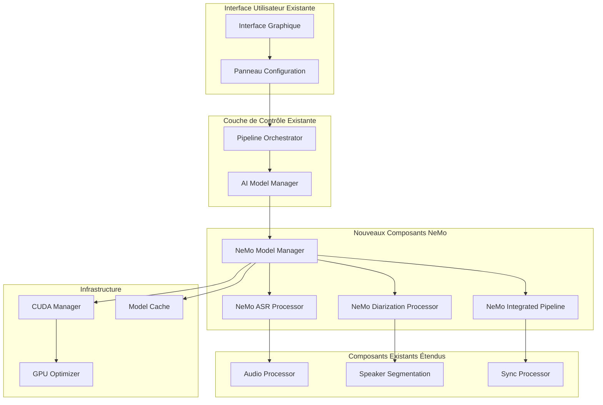

# Document de Conception - Intégration NVIDIA NeMo pour Diarisation et Transcription

## Vue d'Ensemble

L'intégration de NVIDIA NeMo dans l'application de doublage vidéo vise à améliorer significativement la qualité de la transcription automatique (ASR) et de la diarisation des locuteurs. Cette intégration s'appuie sur l'architecture modulaire existante en étendant les composants `AIModelManager`, `AudioProcessor` et `SpeakerSegmentation` pour supporter les modèles NeMo de pointe.

NeMo offre des modèles pré-entraînés optimisés pour GPU qui surpassent souvent Whisper et Pyannote.audio en termes de précision, particulièrement pour la diarisation multi-locuteurs et la transcription dans des environnements bruyants.

## Architecture

### Architecture d'Intégration NeMo



### Pipeline de Traitement NeMo

Le système offre trois modes de traitement NeMo :

1. **Mode ASR Seul** : Utilise uniquement les modèles Conformer de NeMo pour la transcription
2. **Mode Diarisation Seule** : Utilise TitaNet pour la diarisation avec fallback vers ASR existant
3. **Mode Intégré** : Pipeline unifié ASR + Diarisation pour une cohérence optimale

## Composants et Interfaces

### 1. NeMo Model Manager

**Responsabilité :** Gestion centralisée des modèles NeMo avec optimisation GPU et cache intelligent

**Interface :**
```python
class NeMoModelManager:
    def __init__(self, cuda_manager: CUDAManager):
        self.cuda_manager = cuda_manager
        self.loaded_models: Dict[str, Any] = {}
        self.model_cache = ModelCache()
        
    def load_asr_model(self, model_name: str = "stt_en_conformer_ctc_large", device: str = "auto") -> Any:
        """Charge un modèle ASR NeMo sur le dispositif spécifié"""
        
    def load_diarization_model(self, model_name: str = "titanet_large", device: str = "auto") -> Any:
        """Charge un modèle de diarisation TitaNet sur le dispositif spécifié"""
        
    def load_integrated_model(self, device: str = "auto") -> Tuple[Any, Any]:
        """Charge les modèles ASR et diarisation sur le même dispositif"""
        
    def optimize_device_memory(self, device: str) -> None:
        """Optimise l'utilisation de la mémoire selon le dispositif"""
        
    def switch_device(self, model_type: str, new_device: str) -> bool:
        """Bascule un modèle vers un autre dispositif"""
        
    def unload_model(self, model_type: str) -> None:
        """Décharge un modèle pour libérer la mémoire"""
        
    def get_model_info(self, model_name: str) -> ModelInfo:
        """Retourne les informations détaillées d'un modèle"""
```

### 2. NeMo ASR Processor

**Responsabilité :** Transcription audio haute qualité avec modèles Conformer

**Modèles supportés :**
- `stt_en_conformer_ctc_large` : Anglais, haute précision
- `stt_multilingual_fastconformer_hybrid_large_pc` : Multilingue
- `stt_fr_conformer_ctc_large` : Français optimisé

**Interface :**
```python
class NeMoASRProcessor:
    def __init__(self, model_manager: NeMoModelManager):
        self.model_manager = model_manager
        self.current_model = None
        
    def transcribe_audio(self, audio_path: str, language: str = "fr") -> NeMoTranscriptionResult:
        """Transcrit un fichier audio avec horodatages précis"""
        
    def transcribe_with_confidence(self, audio_path: str) -> NeMoTranscriptionResult:
        """Transcription avec scores de confiance détaillés"""
        
    def batch_transcribe(self, audio_segments: List[str]) -> List[NeMoTranscriptionResult]:
        """Transcription par lots pour optimiser les performances GPU"""
        
    def get_word_alignments(self, audio_path: str, text: str) -> List[WordAlignment]:
        """Alignement forcé texte-audio au niveau du mot"""
```

### 3. NeMo Diarization Processor

**Responsabilité :** Diarisation avancée des locuteurs avec TitaNet

**Interface :**
```python
class NeMoDiarizationProcessor:
    def __init__(self, model_manager: NeMoModelManager):
        self.model_manager = model_manager
        self.speaker_model = None
        
    def diarize_audio(self, audio_path: str, num_speakers: Optional[int] = None) -> NeMoDiarizationResult:
        """Diarisation complète avec détection automatique du nombre de locuteurs"""
        
    def extract_speaker_embeddings(self, audio_path: str) -> Dict[str, np.ndarray]:
        """Extraction d'embeddings pour chaque locuteur détecté"""
        
    def cluster_speakers(self, embeddings: Dict[str, np.ndarray]) -> SpeakerClusters:
        """Clustering avancé des locuteurs avec scores de confiance"""
        
    def handle_overlapping_speech(self, audio_path: str) -> OverlapAnalysis:
        """Détection et traitement des chevauchements de parole"""
        
    def refine_boundaries(self, initial_segments: List[SpeakerSegment]) -> List[SpeakerSegment]:
        """Raffinement des frontières de segments avec VAD avancé"""
```

### 4. NeMo Integrated Pipeline

**Responsabilité :** Pipeline unifié combinant ASR et diarisation pour une cohérence optimale

**Interface :**
```python
class NeMoIntegratedPipeline:
    def __init__(self, model_manager: NeMoModelManager):
        self.model_manager = model_manager
        self.asr_processor = NeMoASRProcessor(model_manager)
        self.diarization_processor = NeMoDiarizationProcessor(model_manager)
        
    def process_audio_unified(self, audio_path: str, config: NeMoConfig) -> IntegratedResult:
        """Traitement unifié ASR + Diarisation avec résolution de conflits"""
        
    def resolve_attribution_conflicts(self, asr_result: NeMoTranscriptionResult, 
                                    diarization_result: NeMoDiarizationResult) -> ResolvedResult:
        """Résolution intelligente des conflits d'attribution locuteur-texte"""
        
    def generate_speaker_aware_transcript(self, integrated_result: IntegratedResult) -> SpeakerTranscript:
        """Génération d'une transcription structurée par locuteur"""
```

### 5. CUDA Manager

**Responsabilité :** Gestion optimisée des ressources GPU et détection CUDA

**Interface :**
```python
class CUDAManager:
    def __init__(self):
        self.cuda_available = self._detect_cuda()
        self.gpu_memory_info = self._get_gpu_memory()
        
    def _detect_cuda(self) -> bool:
        """Détection automatique de CUDA et des drivers NVIDIA"""
        
    def _get_gpu_memory(self) -> GPUMemoryInfo:
        """Récupération des informations mémoire GPU"""
        
    def determine_device(self, config: NeMoConfig) -> str:
        """Détermine le dispositif à utiliser selon la configuration et disponibilité"""
        
    def validate_device_selection(self, device_mode: str) -> DeviceValidationResult:
        """Valide la sélection de dispositif et propose des alternatives si nécessaire"""
        
    def optimize_for_model(self, model_size: str, device: str) -> DeviceConfig:
        """Configuration optimisée selon la taille du modèle et le dispositif"""
        
    def monitor_device_usage(self, device: str) -> DeviceUsageStats:
        """Monitoring en temps réel de l'utilisation du dispositif"""
        
    def handle_device_error(self, error: Exception, device: str) -> RecoveryStrategy:
        """Gestion des erreurs de dispositif avec suggestions de fallback"""
```

## Modèles de Données

### Configuration NeMo
```python
@dataclass
class NeMoConfig:
    # Modèles
    asr_model: str = "stt_fr_conformer_ctc_large"
    diarization_model: str = "titanet_large"
    language: str = "fr"
    
    # Mode de traitement
    processing_mode: str = "integrated"  # "asr_only", "diarization_only", "integrated"
    
    # Sélection de dispositif de calcul
    device_mode: str = "auto"  # "auto", "gpu", "cpu"
    force_cpu: bool = False  # Force l'utilisation du CPU même si GPU disponible
    
    # Paramètres ASR
    enable_word_timestamps: bool = True
    confidence_threshold: float = 0.7
    batch_size: int = 16
    
    # Paramètres Diarisation
    num_speakers: Optional[int] = None
    min_speakers: int = 1
    max_speakers: int = 10
    clustering_threshold: float = 0.7
    
    # Optimisations GPU (utilisées seulement si device_mode != "cpu")
    use_gpu: bool = True
    gpu_memory_fraction: float = 0.8
    enable_mixed_precision: bool = True
    
    # Fallbacks
    fallback_to_whisper: bool = True
    fallback_to_pyannote: bool = True
```

### Résultats NeMo
```python
@dataclass
class NeMoTranscriptionResult:
    text: str
    word_timestamps: List[WordTimestamp]
    confidence_scores: List[float]
    language_detected: str
    processing_time: float
    model_used: str
    
@dataclass
class NeMoDiarizationResult:
    speaker_segments: List[SpeakerSegment]
    speaker_embeddings: Dict[str, np.ndarray]
    num_speakers_detected: int
    overlap_regions: List[OverlapRegion]
    confidence_matrix: np.ndarray
    processing_time: float
    
@dataclass
class IntegratedResult:
    transcription: NeMoTranscriptionResult
    diarization: NeMoDiarizationResult
    speaker_transcript: Dict[str, List[TranscriptSegment]]
    attribution_confidence: List[float]
    conflict_regions: List[ConflictRegion]
    quality_metrics: QualityMetrics
```

### Métriques de Qualité
```python
@dataclass
class QualityMetrics:
    # ASR
    estimated_wer: float  # Word Error Rate estimé
    avg_confidence: float
    low_confidence_segments: List[TimeInterval]
    
    # Diarisation
    speaker_purity: float  # Pureté des clusters de locuteurs
    speaker_coverage: float  # Couverture des segments
    overlap_handling_score: float
    
    # Intégration
    attribution_accuracy: float  # Précision d'attribution locuteur-texte
    temporal_consistency: float  # Cohérence temporelle
    conflict_resolution_rate: float
```

## Intégration avec l'Architecture Existante

### Extension de AIModelManager

```python
class AIModelManager:
    def __init__(self):
        # Composants existants
        self.model_discovery = ModelDiscovery()
        self.lm_studio_manager = LMStudioManager()
        
        # Nouveau composant NeMo
        self.nemo_manager = NeMoModelManager(CUDAManager())
        self.nemo_available = self._check_nemo_availability()
        
    def get_available_asr_models(self) -> List[str]:
        """Retourne tous les modèles ASR disponibles (Whisper + NeMo)"""
        models = ["whisper-tiny", "whisper-base", "whisper-large-v3"]
        if self.nemo_available:
            models.extend([
                "nemo-conformer-ctc-large",
                "nemo-fastconformer-multilingual",
                "nemo-conformer-fr"
            ])
        return models
        
    def transcribe_with_best_model(self, audio_path: str, config: PipelineConfig) -> TranscriptionResult:
        """Utilise le meilleur modèle disponible selon la configuration"""
        if config.asr_model.startswith("nemo-") and self.nemo_available:
            return self.nemo_manager.transcribe_audio(audio_path, config)
        else:
            return self._transcribe_with_whisper(audio_path, config)
```

### Extension de AudioProcessor

```python
class AudioProcessor:
    def __init__(self, ai_model_manager: AIModelManager):
        self.ai_model_manager = ai_model_manager
        self.nemo_processor = None
        
    def perform_advanced_diarization(self, audio_path: str, config: PipelineConfig) -> DiarizationResult:
        """Diarisation avec NeMo si disponible, sinon Pyannote"""
        if config.enable_nemo_diarization and self.ai_model_manager.nemo_available:
            nemo_processor = self.ai_model_manager.nemo_manager.get_diarization_processor()
            return nemo_processor.diarize_audio(audio_path, config.num_speakers)
        else:
            return self._diarize_with_pyannote(audio_path, config)
```

## Gestion des Erreurs et Fallbacks

### Stratégie de Fallback

1. **Erreur CUDA :** Basculement automatique vers CPU avec avertissement performance
2. **Modèle NeMo indisponible :** Fallback vers Whisper/Pyannote selon configuration
3. **Mémoire GPU insuffisante :** Traitement par segments plus petits ou basculement CPU
4. **Erreur de transcription :** Retry avec paramètres réduits puis fallback

**Interface :**
```python
class NeMoErrorHandler:
    def handle_cuda_error(self, error: CUDAError) -> RecoveryAction:
        """Gestion des erreurs CUDA avec stratégies de récupération"""
        
    def handle_model_loading_error(self, error: ModelLoadingError) -> FallbackStrategy:
        """Gestion des erreurs de chargement de modèles"""
        
    def handle_processing_error(self, error: ProcessingError) -> RetryStrategy:
        """Gestion des erreurs de traitement avec retry intelligent"""
        
    def suggest_optimization(self, performance_issue: PerformanceIssue) -> List[OptimizationSuggestion]:
        """Suggestions d'optimisation basées sur les problèmes détectés"""
```

## Optimisations de Performance

### Optimisations GPU
- **Chargement paresseux** : Modèles chargés uniquement quand nécessaire
- **Cache intelligent** : Réutilisation des modèles entre sessions
- **Precision mixte** : FP16 pour réduire l'utilisation mémoire
- **Batch processing** : Traitement par lots pour optimiser le débit GPU

### Optimisations Mémoire
- **Segmentation adaptative** : Découpage intelligent selon la mémoire disponible
- **Garbage collection** : Libération proactive de la mémoire
- **Model sharding** : Partitionnement des gros modèles si nécessaire

### Monitoring Performance
```python
class PerformanceMonitor:
    def monitor_nemo_processing(self, operation: str) -> PerformanceMetrics:
        """Monitoring détaillé des opérations NeMo"""
        
    def generate_performance_report(self) -> PerformanceReport:
        """Rapport de performance avec recommandations"""
        
    def detect_bottlenecks(self) -> List[Bottleneck]:
        """Détection automatique des goulots d'étranglement"""
```

## Stratégie de Test

### Tests d'Intégration NeMo
- **Tests de disponibilité** : Vérification installation et compatibilité CUDA
- **Tests de performance** : Benchmarks ASR et diarisation vs solutions existantes
- **Tests de qualité** : Métriques WER, DER (Diarization Error Rate)
- **Tests de fallback** : Validation des stratégies de récupération

### Tests de Régression
- **Compatibilité ascendante** : Validation que l'intégration n'affecte pas les fonctionnalités existantes
- **Tests de charge** : Performance avec différentes tailles de fichiers
- **Tests multi-GPU** : Validation sur configurations multi-GPU

**Structure de test :**
```python
class TestNeMoIntegration:
    def test_nemo_installation_detection(self)
    def test_cuda_compatibility(self)
    def test_asr_quality_vs_whisper(self)
    def test_diarization_quality_vs_pyannote(self)
    def test_integrated_pipeline_coherence(self)
    def test_fallback_mechanisms(self)
    def test_gpu_memory_optimization(self)
    def test_performance_benchmarks(self)
```

Cette conception assure une intégration transparente de NeMo tout en préservant la flexibilité et la robustesse de l'architecture existante.